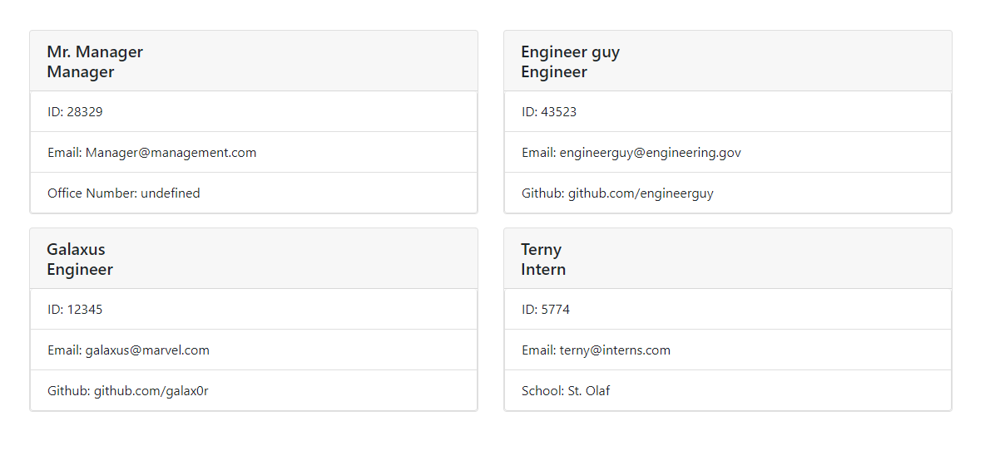
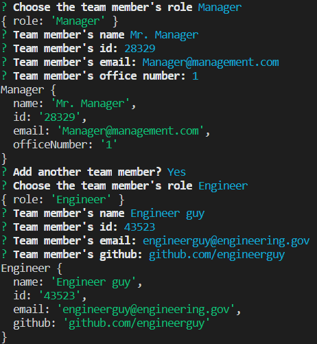

# Team Profile Generator

This program lets a manager create a page that displays their team member's key information via terminal prompts.

## Installation

To install, run npm init in your terminal, then run npm install to get inquirer. 

## Usage

For a manager who wants to have a single page to find both general and specific information about each team member based on their roles.

## Technologies used
- Node JS
- Inquirer
- Jest
- Bootstrap

## Tests
You can run tests to make sure the application is working by typing `npm run test`. Make sure you installed Jest with `npm install`.

## Author

**Sammy Kroner**

[LinkedIn](www.linkedin.com/in/samuel-kroner-44aa11169)

[GitHub](https://github.com/sammyk118)

## Acknowledgements
UC Berkeley Extension